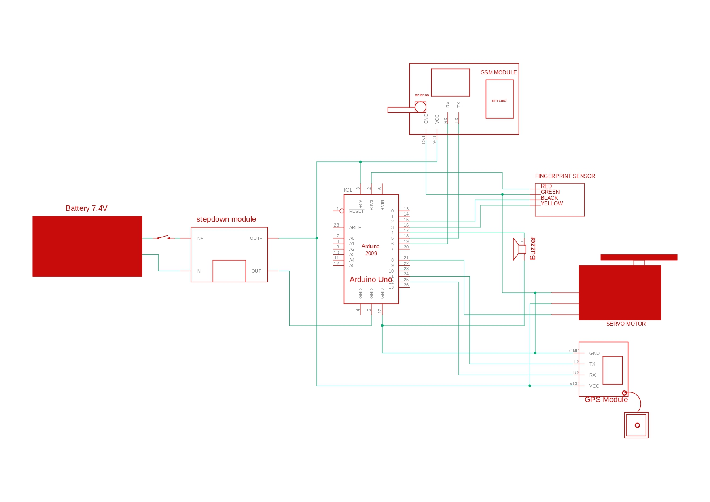

# Anti-theft fingerprint bag lock

My final year project for the Bachelor of Computer Science (Hons.) Netcentric Computing at Universiti Teknologi MARA (UiTM), 2023. An Arduino Uno bag lock: one enrolled fingerprint toggles a servo lock, and three failed matches in a row sound the buzzer and text the bag's GPS coordinates to a preset number over a GSM module.

## How it works

- Matching runs on the fingerprint sensor itself, which stores the enrolled templates and returns an ID and a confidence score.
- A successful match toggles the lock: the servo turns to 90 degrees to unlock, and back to 0 on the next match to lock.
- After three failed matches in a row, the buzzer beeps three times, the sketch reads the GPS, and the GSM module sends two text messages: a plain warning, then the latitude and longitude to six decimal places.
- There is no screen, so the buzzer does all the talking, with a different beep for boot, image captured, match, no match and the theft alert.
- An Uno cannot listen on three SoftwareSerial ports at once, because they share one pin-change interrupt. The sketch opens, uses and closes the fingerprint, GSM and GPS ports in turn, which is what lets three serial peripherals share one board.

## Hardware

- Arduino Uno
- Optical fingerprint sensor, driven by the Adafruit Fingerprint library
- GSM module (for example a SIM900) with its antenna and a SIM card
- GPS module (for example a u-blox NEO-6M) with an external antenna
- Servo motor and buzzer
- A 7.4 V battery feeding a step-down module through a switch, as the schematic shows

| Part | Uno pins | Baud |
| --- | --- | --- |
| Fingerprint sensor | 2, 3 | 57600 |
| Buzzer | 4 | |
| GSM module | 5, 6 | 115200 |
| Servo | 8 | |
| GPS module | 10, 12 | 9600 |

## Setup

1. In the Arduino IDE, install the Adafruit Fingerprint Sensor library and TinyGPSPlus. Servo and SoftwareSerial come with the IDE.
2. Enroll a fingerprint as ID 1 with the enroll example that ships with the Adafruit library. The sketch unlocks for fingerprint ID 1.
3. Set `ALERT_NUMBER` at the top of the sketch to the phone number that should receive the alerts, in international format.
4. Wire the parts as in the schematic and the table above, then upload the sketch to the Uno.
